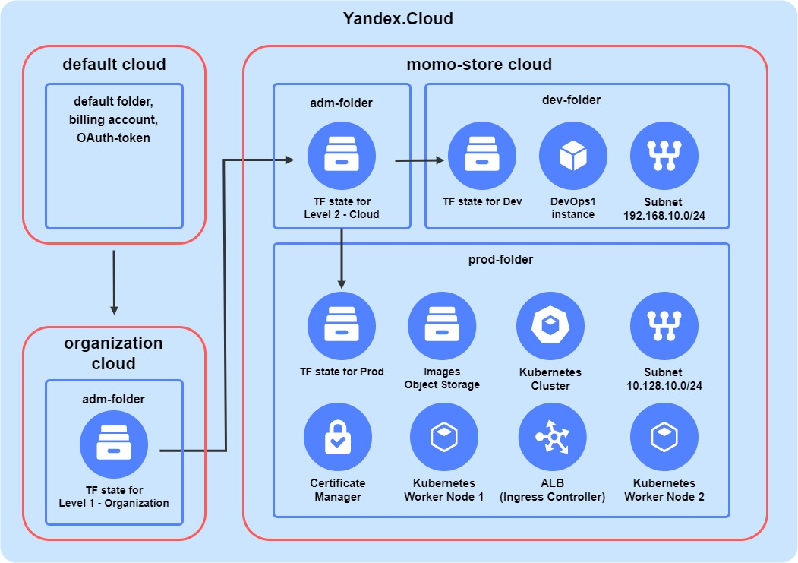

# Задание 1. Модульная инфраструктура для нескольких сред

## Настройка окружения

1. Проект - cloud в Yandex Cloud.
2. В проекте 3 окружения: dev, stage и prod.
3. Каждое окружение - отдельный фолдер в облаке.
4. Для каждого окружения свой проект с terraform.state, настроенном на S3-хранилище (тоже в облаке в отдельном админском фолдере).
5. Модуль вызывается в main.tf вот так:
```Terraform
module "test-vm-dev" {
  source                      = "../../modules/instance"
  count                       = 1
```
6. Параметры передаются в модуль через variables вот так: `  instance_zone               = var.zone`, все variables задокументированы и их можно прочитать через terraform.
7. Через output Terraform выводит сгенерированные значения объектов облака, которые могут потребоваться для ручной настройки или их можно переиспользовать при вызове модуля, например, ip-адреса или id подсети вот так:

```terraform
output "id" {
  description = "VPC subnet ID"
  value       = data.yandex_vpc_subnet.subnet.subnet_id
}
...
 instance_subnet_id          = module.test-subnet-dev.id
 ```


6. Переменные, хранящие чувствительные данные, генерируютсятся скриптом и (или) передаются (хранятся) в переменную окружения вида `$TF_VAR_*` , которые видит Terraform.
7. Создание облака, фолдеров, сервисных аккаунтов, s3-хранилищ, групп-безопасности - за рамками этого задания. Но можно посмотреть референс из моего курса по DevOps в Яндекс Практикуме:

Пример окружения:

Инфраструктурная часть проекта: https://gitlab.com/voitenkov/momo-store/-/blob/main/infrastructure/README.md

Модули: https://gitlab.com/voitenkov/momo-store/-/tree/main/infrastructure/modules 

## Запуск окружения

Для развертывания инфрастуктуры в нужном окружении требуется выполнить следующие команды:

1. `cd env/имя_окружения` # перейти в каталог с Terraform-проектом окружения
2. `./activate-yc-profile.sh` # активировать профиль YC CLI и установить переменные окружения для cloud-id and folder-id.
3. `./secrets.sh` # (в .gitignore) установить переменные окружения для access key и secret key S3-хранилища, в котором находится Terraform-state.
4. `terraform init`
5. `terraform apply`
