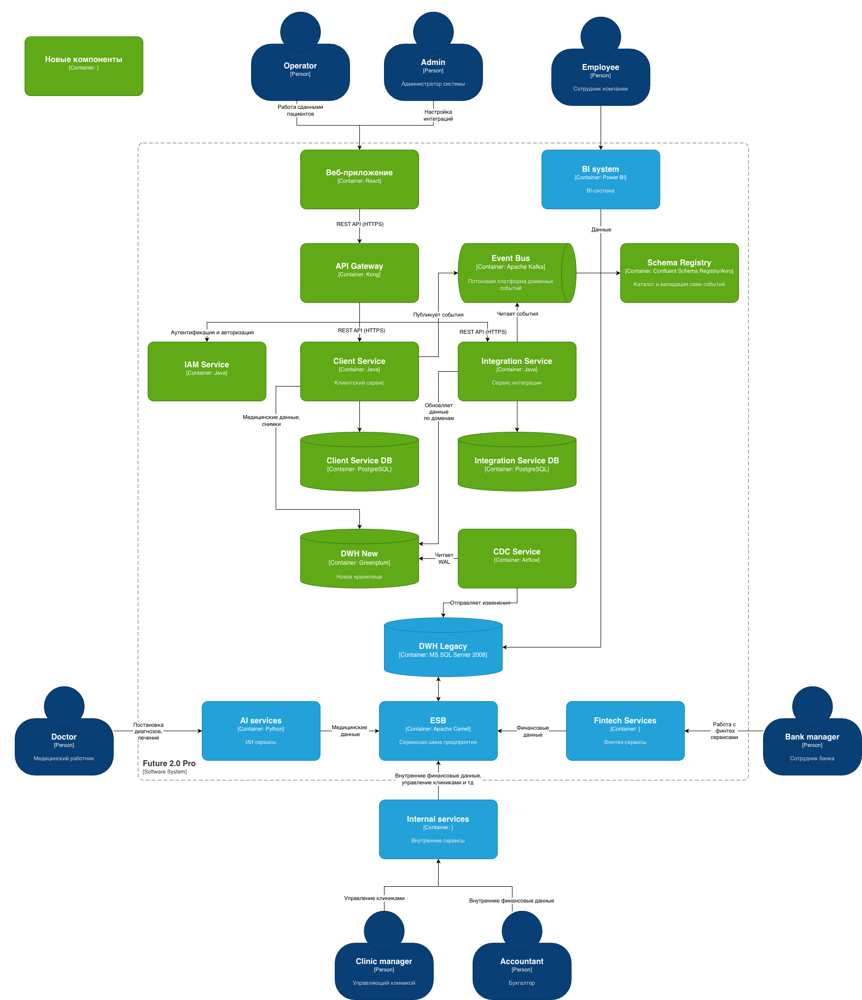
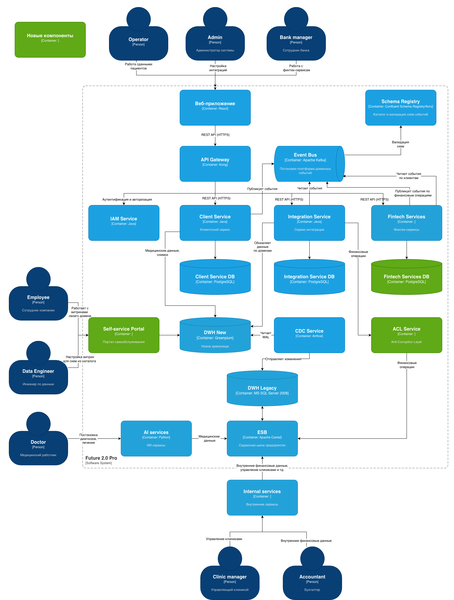
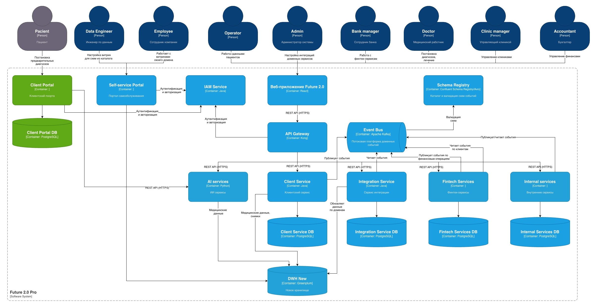

# Задание 3. Проектирование целевой архитектуры и оценка рисков внедрения

## Целевая архитектура системы

### Целевая архитектура системы через 6 месяцев (1 этап)

### Целевая архитектура системы через 18 месяцев (2 этап)

### Целевая архитектура системы через 36 месяцев (3 этап)

## Карта рисков трансформации

|ID|Риск|Тип|Вероятность|Влияние на бизнес|Примечание|
|--|----|---|-----------|-----------------|----------|
|RISK-01|Неверное разделение на домены|Архитектурный|Средняя|Высокое|Приведет к тесной связности, высокая стоимость переделки на поздних этапах|
|RISK-02|Vendor-lock облачного провайдера|Архитектурный|Средняя|Среднее|Большие издержке при переезде на другого провайдера|
|RISK-03|"Подводные камни" legacy-систем|Технологический|Средняя|Высокое|"Тайные знания", зашитые в бизнес-логике могут привезти к ошибкам и потерям данных при миграции|
|RISK-04|Event Bus может стать узким местом|Технологический|Низкая|Высокое|С одной стороны Kafka обладает высокой производительностью, с другой стороны объем данных гигантский и нет данных по тестированию|
|RISK-05|Нехватка экспертизы по новому стеку|Организационный|Высокая|Среднее||
|RISK-06|Сопротивление изменениям|Организационный|Высокая|Среднее|Специалисты, поддерживающие legacy-системы, могут открыто или скрыто саботировать процесс трансформации|
|RISK-07|Большая нагрузка на команду|Организационный|Высокая|Среднее|Из-за необходимости поддерживать legacy систему и новую системы во время миграции|
|RISK-08|Нарушения законодательства при миграции|Бизнес-риски|Низкая|Высокое|Законодательство по ПД в разных странах может отличаться. Риск нарушений законодательства по ПД и требований ЦБ для финансовых данных при миграции в облако|
|RISK-09|Срыв сроков или превышение бюджета|Бизнес-риски|Среднее|Высокое|Недооценка сложности из-за незнания нюансов legacy-систем|

## План управления рисками

### Неверное разделение на домены (RISK-01)

Меры по снижению:

- Управленческие:
  - Использовать методику Event Storming с самого начала проектирования.
  - Проводить Review архитектуры с участием представителей всех доменов.
  - Использовать итеративный подход - bounded contexts уточняются в ходе проектирования.

- Технические:
  - Настроить мониторинг и трассировку междоменных вызовов. Если появляются синхронные зависимости, пересмотреть границы bounded contexts.

### Vendor-lock облачного провайдера (RISK-02)

- Организационные:
  - При выборе провайдера учесть соответствие локальному законодательству по ПД, а также нормативам для финансовых организация (например, PCIDSS).
  - Выбираем провайдера не только исходя из стоимости, а также, исходя из его надежности и долгосрочных перспектив присутствия на рынке.

- Технические:
  - По-возможности не использовать Managed решения для брокеров очередей и баз данных.
  - Использовать средства оркестрации контейнеров, например Kubernetes.
  - Использовать для IAM Keycloak, а не встроенный IAM провайдера.
  - Использовать в IaC модули Terraform. 

### "Подводные камни" legacy-систем (RISK-03)

- Технические:
  - Полный аудит систем, баз данных, таблиц, модулей.
  - Описание архитектуры (еcли отсутствует).
  - Выявление недокументированных функций систем.

### Event Bus может стать узким местом (RISK-04)

- Технические:
  - Настройка партиционирования в соотвествии с доменами.
  - Настройка мониторинга и алертинга.
  - Проведение нагрузочного тестирования на объемах данных, близких к ожидаемым.

### Нехватка экспертизы по новому стеку (RISK-05)

- Управленческие:
  - Обучение имеющихся специалистов, сертифицированные курсы.
  - Дополнительный найм специалистов с нужной экспертизой.
  - Привлечение внешних экспертов на начальном этапе.

### Сопротивление изменениям (RISK-06)

- Управленческие:
  - Информирование и прозрачность процессов, четкие цели и сроки.
  - Вовлечение специалистов по legacy-системам в процесс проектирования.
  - Переобучение специалистов по legacy-системам, мотивация возможностью карьерного роста.

### Большая нагрузка на команду (RISK-07)

- Управленческие:
  - Снижение задач по legacy-системам, только закрываем критические баги.
  - Разделение обязанностей, чтобы один и тот же сотрудник одновременно не занимался и старой и новой системой.
  - Найм специалистов на время миграции.
  - Отслеживание нагрузки и исключение переработок.

### Нарушения законодательства при миграции (RISK-08)

- Управленческие:
  - Аудит требований регуляторов до начала трансформации.
  - Аудит облачного провайдера на соответствие требованиям регуляторов.

- Технические:
  - Соблюдение принципов Privacy by Design.
  - Настройка логирования и аудита безопасности.

### Срыв сроков или превышение бюджета (RISK-09)

- Организационные:
  - Выделение отдельного сотрудника на ведение проекта (Project Manager).
  - Выбор правильной методологии разработки: Agile методолгия может не вписываться в цели бизнеса.
  - Трекинг трудозатрат, проведение регулярных мероприятий в соответствии с выбранной методологией разработки.
  - Регулярное уточнение оценок сроков.