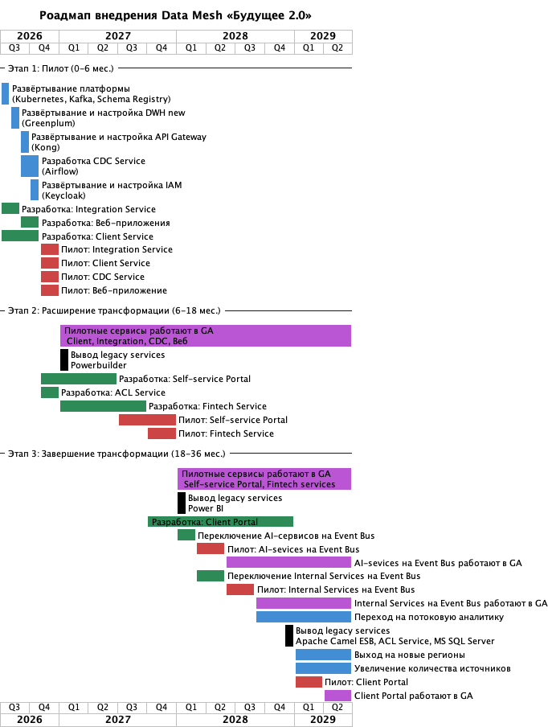

# Стратегический роадмап внедрения Data Mesh

## Визуализация

## Ключевые роли

|Роль|Этапы|Кто исполняет роль|Какие обязанности|
|----|----|------------------|-----------------|
|Data Product Owner|1-3|Product Owner или аналитик домена|Определяет состав данных домена, управляет бэклогом, выполняет приоритезацию|
|Data Engineer|2-3|DBA, разработчик или инженер доменной команды|Настраивает пайпланы загрузки данных, мигрирует данные на новый DWH, добавляет в Integration Service сервис домена, настраивает Self-service Portal применительно к своему домену|
|BI-аналитик|3|Текущие бизнес или дата-аналитики|Использует Self-service Portal, настраивает витрины данных|

## Привязка к бизнес-целям

|Бизнес-цель|Этап|Задачи из Roadmap|
|-----------|----|------|
|Определены домены и их границы|Этап 0|Разработать диаграмму Event-Storming, выделить домены, bounded contexts, агрегаты, события|
|Определена событийная модель|Этап 0|Разработать каталог доменных событий|
|Разработана целевая архитектура|Этап 0|Разработаны диаграммы C4 для всех этапов трансформации|
|Разработан роадмап трансформации|Этап 0|Разработан роадмап, нарезаны задачи, определены сроки и ответственные, произведен расчет TCO|
|Запущены пилоты в первых двух доменах|Этап 1|Развернуть платформу, разработать и запустить Integration, Client, CDC сервисы и веб-приложение|
|Запущен портал самообслуживания|Этап 2|Разработать и запустить Self-service portal|
|Выполнена трансформация финтех-сервисов|Этап 2|Разработать и запустить новые Fintech сервисы|
|Запущены новые медицинские сервисы, ИИ-функции монетизированы|Этап 3|Разработать и запустить Client Portal, трансформировать AI-сервисы|
|Данные: увеличение количества источников и событий, переход от пакетной отчётности («batch») к near-real-time обработке|Этап 3|Переход на потоковую аналитику|
|География: выход на два-три новых региона с учётом локальных требований|Этап 3|Выход на новые регионы|